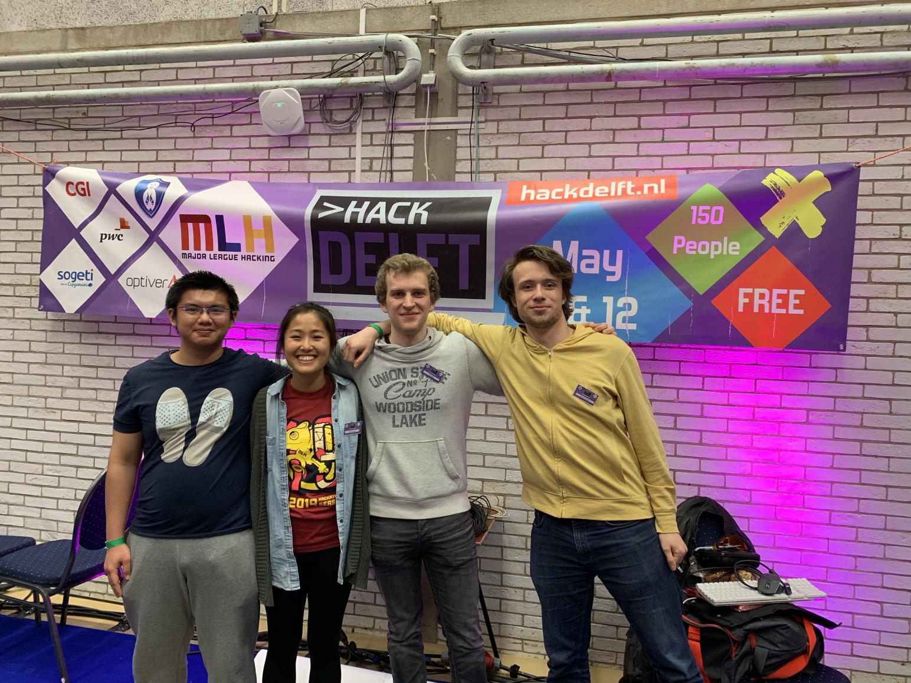

# HackDelft 2019  
   

Members:  
Olivia, Teddy, Nathan, Tobias  

## Goals:  
1. Read the data from the server about the markets  
2. Save market data  
3. Implement a basic trade algorithm  
4. Deploy a website to display real time data  
5. Understand trading strategies  
6. Have fun! 
