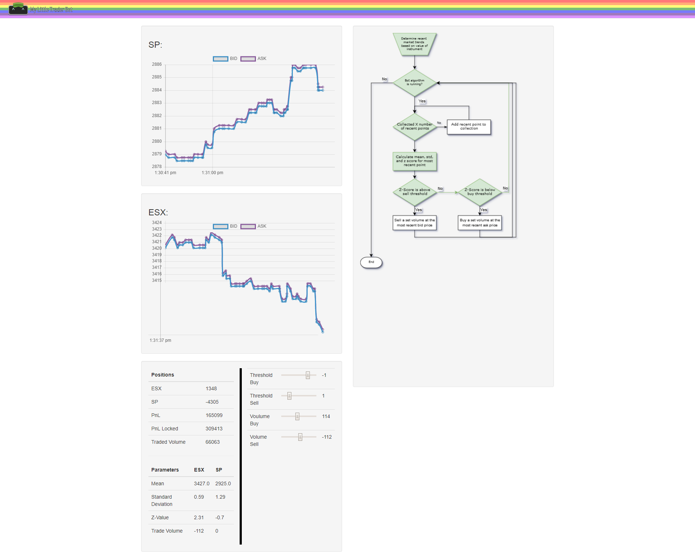

# HackDelft 2019  
 

Members:  
Olivia, Teddy, Nathan, Tobias  

## Our challenge:  
We were presented a challenge from Optiver and access to the following 
instructions--https://github.com/jundl77/optiver-hackdelft-challenge. 
Our initial exploration of the data and realization that we lacked 
some basic knowledge about day-trading led us to plan and create a 
user interface for students (like ourselves) and anyone else who lacks 
financial literacy to explore trading algorithms and learn how to best 
invest their hard-earned money. 

## Goals:  
1. Read the data from the server about the markets  
2. Save market data  
3. Implement a basic trade algorithm  
4. Deploy a website to display real time data  
5. Understand trading strategies  
6. Have fun!  

## Our product:  

